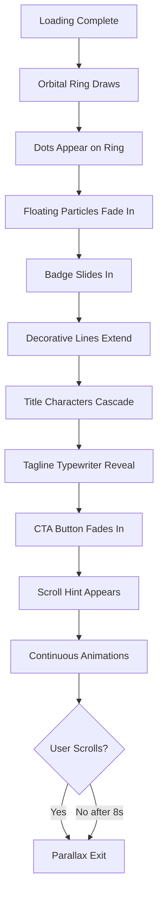

# TunnelIntro Enhanced Animations Plan

## Overview

This plan outlines specific improvements to enhance the [`TunnelIntro.jsx`](src/components/TunnelIntro.jsx) component with better animations, particle effects, and smoother transitions.

## Current State Analysis

The existing TunnelIntro component includes:

- Orbital ring with SVG animation (Phase 0-1)
- Floating particles (Phase 1b)
- 3D letter cascade for "WanBitha" (Phase 2)
- Decorative lines extension (Phase 2b)
- Badge slide-in (Phase 3)
- Tagline word reveal (Phase 4)
- CTA button fade-in (Phase 5)
- Scroll hint pulse (Phase 6)
- Continuous rotations and breathing animations
- Scroll-driven parallax exit

## Proposed Enhancements

### 1. Enhanced SVG Orbital Ring

**Improvements:**

- Add multiple concentric rings with different dash patterns
- Implement glow effects using CSS filters and drop-shadows
- Add animated gradient strokes that pulse
- Create ring segments that animate independently

**Implementation:**

```jsx
// Multiple ring layers
<circle className="ring-primary" ref={ringRef} ... />
<circle className="ring-secondary" ... />
<circle className="ring-glow" ref={ringGlowRef} ... />
<circle className="ring-accent" ... />
```

**CSS Additions:**

```css
.ring-primary {
  filter: drop-shadow(0 0 15px rgba(192, 132, 252, 0.3));
}
.ring-glow {
  filter: blur(4px);
  animation: ringPulse 2s ease-in-out infinite;
}
@keyframes ringPulse {
  0%,
  100% {
    opacity: 0.3;
  }
  50% {
    opacity: 0.7;
  }
}
```

### 2. Dynamic Floating Particles

**Improvements:**

- Increase particle count from 6 to 12
- Add varied sizes (2-6px)
- Implement smooth floating with sine wave motion
- Add color variations (purple, pink, gold)
- Create particle trails that follow mouse movement
- Add subtle glow effects to each particle

**Implementation:**

```jsx
const particles = [
  { x: -25, y: -20, size: 3, color: "#c084fc", speed: 0.3 },
  { x: 30, y: -15, size: 4, color: "#f472c4", speed: 0.4 },
  { x: -15, y: 25, size: 2, color: "#fbbf24", speed: 0.5 },
  // ... more particles
];
```

**GSAP Animation:**

```javascript
gsap.to(particleRefs.current.filter(Boolean), {
  y: (i) => Math.sin(i * 0.8 + 2) * 20,
  x: (i) => Math.cos(i * 0.6 + 1) * 15,
  opacity: (i) => 0.3 + Math.random() * 0.5,
  scale: (i) => 0.8 + Math.random() * 0.4,
  duration: 3 + Math.random() * 2,
  repeat: -1,
  yoyo: true,
  ease: "sine.inOut",
});
```

### 3. Magnetic CTA Button

**Improvements:**

- Add mouse-follow magnetic effect to CTA button
- Implement smooth transition when mouse approaches
- Add ripple effect on click
- Enhance hover state with gradient glow

**Implementation:**

```jsx
const handleMouseMove = (e) => {
  const rect = buttonRef.current.getBoundingClientRect();
  const x = e.clientX - rect.left - rect.width / 2;
  const y = e.clientY - rect.top - rect.height / 2;
  gsap.to(buttonRef.current, {
    x: x * 0.3,
    y: y * 0.3,
    duration: 0.3,
    ease: "power2.out",
  });
};

const handleMouseLeave = () => {
  gsap.to(buttonRef.current, {
    x: 0,
    y: 0,
    duration: 0.5,
    ease: "elastic.out(1, 0.3)",
  });
};
```

### 4. Typewriter Effect for Tagline

**Improvements:**

- Convert tagline from fade-in to typewriter reveal
- Add cursor blinking animation
- Implement character-by-character reveal
- Add delay between words for dramatic effect

**Implementation:**

```jsx
const TypewriterTagline = () => {
  const [displayText, setDisplayText] = useState("");
  const fullText = "Cores · Texturas · Emoções";

  useEffect(() => {
    let currentIndex = 0;
    const interval = setInterval(() => {
      if (currentIndex <= fullText.length) {
        setDisplayText(fullText.slice(0, currentIndex));
        currentIndex++;
      } else {
        clearInterval(interval);
      }
    }, 80);
    return () => clearInterval(interval);
  }, []);

  return (
    <span className="font-body">
      {displayText}
      <span className="animate-blink">|</span>
    </span>
  );
};
```

### 5. Parallax Depth Layers

**Improvements:**

- Create multiple depth layers (foreground, midground, background)
- Add different parallax speeds to each layer
- Implement smooth mouse-follow parallax
- Add subtle rotation based on mouse position

**Implementation:**

```jsx
const ParallaxSection = () => {
  const layers = [
    { ref: badgeRef, speed: 0.05, depth: "far" },
    { ref: titleRef, speed: 0.1, depth: "mid" },
    { ref: linesRef, speed: 0.15, depth: "near" },
    { ref: ctaRef, speed: 0.2, depth: "closest" },
  ];

  return (
    <div className="parallax-container">
      {layers.map((layer, i) => (
        <div
          key={i}
          ref={layer.ref}
          className={`parallax-layer depth-${layer.depth}`}
          style={{
            transform: `translate(${mousePos.x * layer.speed * 100}px, ${mousePos.y * layer.speed * 100}px)`,
          }}
        />
      ))}
    </div>
  );
};
```

### 6. Mouse-Follow Glow Effect

**Improvements:**

- Add glowing orb that follows mouse cursor
- Implement smooth trailing effect
- Add color gradient that shifts over time
- Create interactive glow on title hover

**Implementation:**

```jsx
const MouseGlow = () => {
  const glowRef = useRef(null);

  useEffect(() => {
    const onMouseMove = (e) => {
      gsap.to(glowRef.current, {
        x: e.clientX,
        y: e.clientY,
        duration: 0.3,
        ease: "power2.out",
      });
    };
    window.addEventListener("mousemove", onMouseMove);
    return () => window.removeEventListener("mousemove", onMouseMove);
  }, []);

  return (
    <div
      ref={glowRef}
      className="fixed pointer-events-none z-50 mix-blend-screen"
      style={{
        width: "200px",
        height: "200px",
        background:
          "radial-gradient(circle, rgba(192,132,252,0.3) 0%, transparent 70%)",
        transform: "translate(-50%, -50%)",
      }}
    />
  );
};
```

### 7. Enhanced Character Reveal

**Improvements:**

- Add rotation to each character during reveal
- Implement elastic easing for dramatic effect
- Add scale bounce on each letter
- Create staggered reveal from center outward

**Implementation:**

```javascript
master.fromTo(
  chars,
  {
    opacity: 0,
    y: 100,
    rotateX: 90,
    scale: 0.3,
    filter: "blur(10px)",
  },
  {
    opacity: 1,
    y: 0,
    rotateX: 0,
    scale: 1,
    filter: "blur(0px)",
    duration: 1,
    stagger: { each: 0.08, from: "center" },
    ease: "elastic.out(1, 0.5)",
  },
  "-=0.3",
);
```

### 8. Scroll Hint Particle Trail

**Improvements:**

- Add animated particles rising from scroll hint
- Implement trail effect that fades out
- Add subtle glow to each particle
- Create continuous emission while visible

**Implementation:**

```jsx
const ParticleTrail = () => {
  const [particles, setParticles] = useState([]);

  useEffect(() => {
    const interval = setInterval(() => {
      const newParticle = {
        id: Date.now(),
        x: Math.random() * 20 - 10,
        y: 0,
        opacity: 1,
      };
      setParticles((prev) => [...prev.slice(-10), newParticle]);
    }, 200);
    return () => clearInterval(interval);
  }, []);

  return (
    <div className="particle-trail">
      {particles.map((p) => (
        <motion.div
          key={p.id}
          initial={{ y: 0, opacity: 1 }}
          animate={{ y: -30, opacity: 0 }}
          transition={{ duration: 1 }}
          className="particle"
          style={{ left: `calc(50% + ${p.x}px)` }}
        />
      ))}
    </div>
  );
};
```

### 9. Reduced Auto-Skip Timer

**Change:**

- Reduce auto-skip from 18000ms (18s) to 8000ms (8s)
- Add visual countdown indicator
- Implement smooth auto-scroll transition

### 10. Smooth Phase Transitions

**Improvements:**

- Add easing functions between all animation phases
- Implement overlapping animations for smoother flow
- Add subtle delays for better pacing
- Create visual connectors between phases

## Implementation Order

1. **CSS Keyframes** - Add new animations to index.css
2. **Core Structure** - Enhance SVG rings and particle system
3. **Mouse Interactions** - Add magnetic effects and glow
4. **Tagline** - Implement typewriter effect
5. **Character Reveal** - Enhance with rotation and scale
6. **CTA Button** - Add magnetic interaction
7. **Scroll Hint** - Add particle trail
8. **Timing** - Reduce auto-skip timer
9. **Polish** - Fine-tune easing and transitions

## Files to Modify

- `src/components/TunnelIntro.jsx` - Main component enhancements
- `src/index.css` - Add new keyframe animations

## Visual Flow Diagram



## Performance Considerations

- Use CSS transforms instead of top/left for animations
- Implement requestAnimationFrame for smooth updates
- Add will-change hints for GPU acceleration
- Consider reduced motion preferences
- Optimize particle count based on device performance

## Success Metrics

- All animations complete within 8 seconds
- Smooth 60fps performance on desktop
- Responsive behavior on mobile devices
- Intuitive user flow with clear visual hierarchy
- Enhanced engagement with interactive elements
